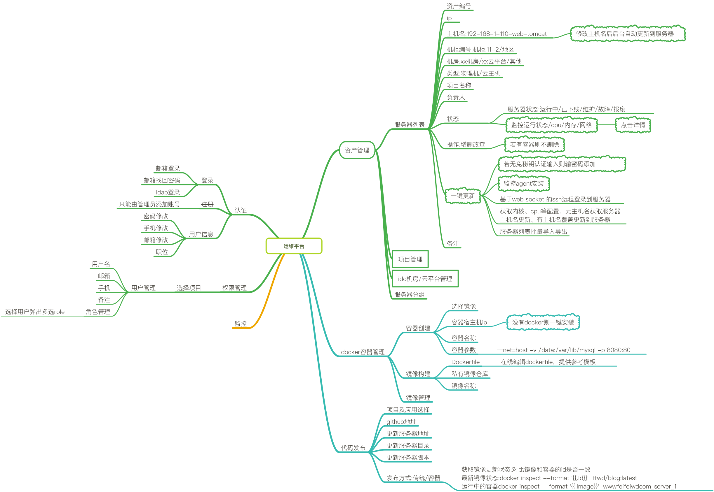

运维平台
==================
前端基于vue iview框架, 后端flask做api

## 功能特色
统一资产信息源, 以此扩展如下功能:
 - 支持ldap,邮箱等多种登录验证方式
 - 基于ansible密码或秘钥批量管理主机
 - 基于websocket的ssh终端
 - 项目分组, 对象级角色管理, 大规模运维分组模块化管理
 - docker容器镜像管理, 镜像持续构建部署
 - 传统代码发布, 定制更新执行步骤, 还原回滚
 - 监控及报警规则, 可设置预处理方案

## 设计思路
<br>

Python Web 开发
==================
基于python3.5的flask框架web server, 请按以下规范开发.

## 学习资料参考
 - [github官网](https://github.com/pallets/flask)
 - [flask中文手册 0.10 文档](http://docs.pythontab.com/flask/flask0.10/index.html)
 - <<[Python Web开发实战](https://github.com/dongweiming/web_develop)>>

## 安装python3.5(建议使用mac或centos7系统,安装第三方模块会更顺利)
```
wget https://www.python.org/ftp/python/3.5.3/Python-3.5.3.tar.xz
tar xf Python-3.5.3.tar.xz
cd Python-3.5.3
./configure --with-pydebug
make
make install
```

## 需要安装的第三方模块

* flask
* redis
* Flask-SQLAlchemy
* Flask-Migrate
* Flask-Security
* Flask-Script
* Flask-RESTful
* Flask-KVSession
* flasgger

```
# 安装第三方模块前最好安装virtualenv,可以创建一个单独干净的python虚拟环境
pip install virtualenv

# 创建虚拟环境命名为venv
virtualenv venv

# 切换到虚拟环境
source venc/bin/activate

# 虚拟环境下安装flask
pip install flask
```

安装过程报错 如下解决
```
yum install python-devel mysql-devel zlib-devel openssl-devel
```

## 目录结构
```
主目录
|-- config/
|   |-- __init__.py
|   |-- settings.py
|   |-- debug_settings.py
|-- api/
|   |-- auth/
|   |   |-__init__.py
|   |   |-model.py
|   |   |-url.py
|   |   |-view.py
|   |-- monitor/
|   |   |-__init__.py
|   |   |-model.py
|   |   |-url.py
|   |   |-view.py
|-- utils/
|   |-__init__.py
|   |-error_code.py
|   |-email.py
|   |-zabbix_api.py
|   |-cacahe.py
|   |-session.py
|-- tests/
|   |-- __init__.py
|   |-- test*.py
|-- .gitignore
|-- requirements.txt
|-- manage.py
|-- logs/
|-- templates/
|-- static/
```

* manage.py 主运行程序
* api目录下存放各功能集的view视图,model表结构,url路由
* utils工具方法
* tests单元测试, example.py是一个post请求的单元测试例子
* config配置文件
* logs日志每日分割

